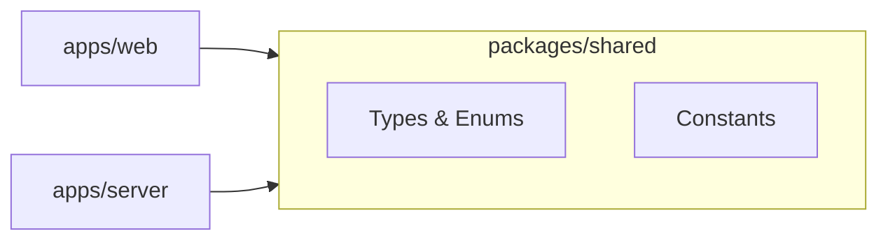

# 🏗️ Monorepo Architecture

This repository is a **full-stack monorepo** that hosts the **React frontend**, **Express backend**, **shared TypeScript types/constants**, and all **infrastructure (Docker, MySQL)** in a single, consistent codebase.

This setup ensures:

-   **Single source of truth** for types, constants, and environment variables
-   **Frictionless development** with hot reloading across frontend and backend
-   **One-command startup** for frontend, backend, and database with `docker compose up`

---

## 📁 Folder Structure (Current)

```plaintext
/matcha
 ├── apps/
 │   ├── web/                # React + Webpack + TS frontend
 │   │   ├── public/         # Static assets (index.html)
 │   │   └── src/            # React entrypoint (index.tsx)
 │   │
 │   └── server/             # Express + TS backend
 │       ├── src/config.ts   # Loads environment variables safely
 │       ├── src/db.ts       # MySQL connection pool
 │       └── src/index.ts    # Express app entry (routes: /api/hello, /api/users)
 │
 ├── packages/
 │   └── shared/             # Shared TS types/constants used by web + server
 │
 ├── docker/
 │   ├── web.Dockerfile      # Builds and runs frontend (uses WEB_PORT from .env)
 │   └── server.Dockerfile   # Builds and runs backend (uses API_PORT from .env)
 │
 ├── docs/                   # Documentation
 │
 ├── .env                    # Local environment variables (not committed)
 ├── .env.example            # Template for environment variables
 ├── package.json            # Root monorepo setup (workspaces, scripts)
 ├── docker-compose.yml      # Spins up web, server, db, and Adminer
 ├── tsconfig.json           # Root TS config with shared path mappings
 └── README.md
```

---

## 📦 Workspaces Setup

The project uses **npm workspaces** to manage dependencies across `apps/*` and `packages/*`.

### Root `package.json`

```jsonc
{
	"private": true,
	"workspaces": ["apps/*", "packages/*"],
	"scripts": {
		"dev:web": "npm --workspace apps/web run dev",
		"dev:server": "npm --workspace apps/server run dev",
		"type-check": "tsc --noEmit"
	},
	"devDependencies": {
		"typescript": "^5.5.0"
	}
}
```

### Typical Commands

```bash
npm run dev:web     # Start Webpack Dev Server
npm run dev:server  # Start Express backend with ts-node-dev
npm run type-check  # Run TS compiler in noEmit mode
```

---

## 🔗 Dependency Flow



**Rule:**
`packages/shared` must never import from `apps/web` or `apps/server` — it must remain independent and reusable.

---

## 🔑 Environment Variables Strategy

-   **`.env` (ignored by Git):**
    Stores all shared and sensitive config:

    ```dotenv
    API_PORT=3000
    WEB_PORT=5173
    APP_NAME="💚 Web Matcha"
    DB_ROOT_PASSWORD=root
    DB_USER=matcha_user
    DB_PASSWORD=matcha_pass
    DB_NAME=matcha
    DB_PORT=3306
    DB_ADMIN_PORT=8080
    ```

-   **`.env.example` (committed):**
    Provides a template with placeholders for contributors.

-   **Server:** Uses `dotenv-safe` in `config.ts` to fail early if a required variable is missing.

-   **Web:** Loads root `.env` in `webpack.config.js`, injects vars with `DefinePlugin`, and proxies `/api` calls to the backend using `server` as Docker hostname.

---

## 🐳 Containerization

-   **Dockerfiles** for web + server use `ARG` + `ENV` for dynamic ports
-   **docker-compose.yml** runs:

    -   **web** → React dev server with hot reload
    -   **server** → Express backend with live reload (ts-node-dev)
    -   **db** → MySQL 8.0 container with persistent volume
    -   **db-admin** → Adminer UI at `http://localhost:${DB_ADMIN_PORT}`

Start everything with:

```bash
docker compose up --build
```

---

## ✅ Minimal Full-Stack Communication

-   **Database:** `users` table created via init script or Adminer
-   **Backend:** `/api/users` fetches all users from DB
-   **Frontend:** Fetches `/api/hello` and `/api/users`, logs results to console

This ensures you have a **working end-to-end setup** (Frontend → Backend → Database).

---

## 📚 Purpose of This Document

This document now accurately describes:

-   🗂 Current repo structure
-   🔗 How apps share code
-   🔑 How environment variables are centralized
-   🐳 How to run full stack locally with Docker
-   ✅ How minimal full-stack data flow is implemented

Next docs (in `/docs`) can go deeper into **frontend architecture** (state management, routing) and **backend architecture** (layered controllers/services/repositories).
