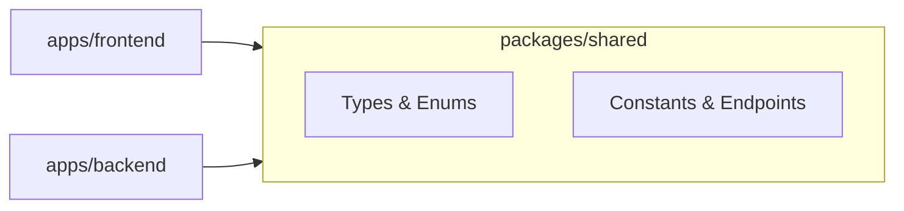

# 🏗️ Monorepo Architecture

This project uses a **monorepo** to host the **frontend, backend, and shared resources** in a single repository.  
This setup makes development easier, enforces consistency, and allows **shared types and constants** between applications.

---

## 📁 Folder Structure

```plaintext
/my-dating-app
 ├── apps/
 │   ├── frontend/         # React app (detailed in frontend doc)
 │   └── backend/          # Express app (detailed in backend doc)
 │
 ├── packages/
 │   └── shared/           # Shared resources (types, enums, constants, endpoint names)
 │
 ├── docker/
 │   ├── frontend.Dockerfile
 │   ├── backend.Dockerfile
 │   └── mysql.Dockerfile (optional, if custom)
 │
 ├── docs/                 # All project documentation
 │
 ├── .env                  # Local environment variables (not committed)
 ├── .env.example          # Template for environment variables
 ├── package.json          # Root package.json (workspaces + scripts)
 ├── docker-compose.yml    # Dev/test/prod orchestration
 ├── tsconfig.json         # Root TypeScript configuration
 └── README.md
```

---

## 📦 Workspaces Setup

The monorepo uses **npm workspaces** to manage dependencies across apps and packages.

### Example `package.json` Snippet

```jsonc
{
	"private": true,
	"workspaces": ["apps/*", "packages/*"],
	"scripts": {
		"dev": "concurrently \"npm:dev:*\"",
		"dev:frontend": "npm --workspace apps/frontend run dev",
		"dev:backend": "npm --workspace apps/backend run dev",
		"lint": "eslint . --ext .ts,.tsx",
		"type-check": "tsc --noEmit"
	}
}
```

### Usage

Run commands like:

```bash
npm run dev:frontend
npm run dev:backend
npm run lint
npm run type-check
```

---

## 🔗 Dependency Flow

The following diagram shows the dependency direction between parts of the monorepo:



**Rule:**  
`packages/shared` must never import anything from frontend or backend — this ensures it stays truly reusable.

---

## 🔑 Environment Variables Strategy

-   **.env (ignored by Git):** Stores local secrets (database password, JWT secret, SMTP credentials).
-   **.env.example (committed):** Provides a template of required environment variables with placeholder values, so contributors know what to set.
-   Each app (frontend, backend) will have its own `.env` file, but may read from a root `.env` for shared values.
-   Use a safe loader (like **dotenv-safe**) in backend to ensure all required variables are defined.

---

## 📚 Purpose of This Document

This document sets the foundation for:

-   🗂 How the repo is structured
-   🔗 How apps share code
-   🔑 How environment variables are handled
-   🏃 How development commands are organized

The next documentation files will go deeper into **frontend structure** and **backend architecture**, following the rules defined here.
